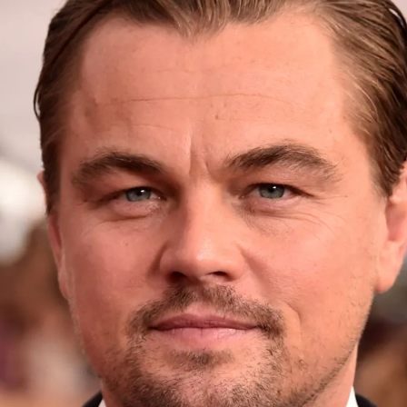

# Concat-ID
[](https://arxiv.org/abs/2503.14151)

[](https://ml-gsai.github.io/Concat-ID-demo/)

# 🔥 Latest News!
* Apr 26, 2025: We release the first-stage models of Concat-ID based on Wan2.1-T2V-1.3B for single identity scenarios.

# ToDo List
- [ ] Improving the model architecture and training strategy.

Identity-preserving video generation is an interesting research topic, and therefore, we look forward to progressively improving this project.

# Concat-ID-Wan

We release the first-stage model of Concat-ID based on Wan2.1-T2V-1.3B for single identity scenarios. 

### 1. Install all dependencies

```
git clone https://github.com/modelscope/DiffSynth-Studio.git
cd DiffSynth-Studio
pip install -e .
pip install insightface onnxruntime
```

### 2. Run scripts to generate videos
```python
python inference_wan.py --image_path="{your_image_path}" --prompt="{your_prompt}"
```

#### For instance:

``` python
python inference_wan.py --image_path="examples/images/69_politicians_woman_Tulsi_Gabbard_4.png" --prompt="A woman, dressed in casual attire, sits by a sunlit window sketching in a notebook, pausing occasionally to look up with a playful grin. As sunlight filters through the sheer curtains, casting soft shadows across the room, the woman twirls a pencil absentmindedly before adding quick strokes to the page. The scene is alive with a sense of relaxed creativity, as the warm afternoon glow bathes the space in a gentle, inviting atmosphere." --output_dir="output/1/"
```

``` python
python inference_wan.py --image_path="examples/images/43_stars_man_Leonardo_DiCaprio_3.png" --prompt="A man with a distant look in his eyes stands alone on the deck of the Titanic, gripping the railing tightly. He watches the horizon, lost in thought, as the cold sea breeze brushes against his face. His mind drifts between excitement for the journey ahead and an unshakable sense of unease about what lies beneath the surface of the dark, mysterious waters." --output_dir="output/2/"
```

``` python
python inference_wan.py --image_path="examples/images/80_normal_man_5.jpg" --prompt="On a warm summer evening, a tall and athletic person is energetically playing a basketball game on the well-lit community court, dribbling the ball with expert precision, dodging imaginary opponents, and shooting hoops with impressive accuracy." --output_dir="output/3/"
```

<table style="width: 100%; border-collapse: collapse; text-align: center; border: 1px solid #ccc;">
  <tr>
    <th style="text-align: center;">
      <strong>Reference images</strong>
    </th>
    <th style="text-align: center;">
      <strong>Generated videos</strong>
    </th>
  </tr>

  <tr>
    <td style="text-align: center; vertical-align: middle;">
      
    </td>
    <td style="text-align: center; vertical-align: middle;">
<video autoplay loop muted playsinline style="width: 400px;">
        <source src="examples/results/1.mp4" type="video/mp4">
    </td>
  </tr>

  <tr>
    <td style="text-align: center; vertical-align: middle;">
      
    </td>
    <td style="text-align: center; vertical-align: middle;">
<video autoplay loop muted playsinline style="width: 400px;">
        <source src="examples/results/2.mp4" type="video/mp4">
    </td>
  </tr>

  <tr>
    <td style="text-align: center; vertical-align: middle;">
      
    </td>
    <td style="text-align: center; vertical-align: middle;">
<video autoplay loop muted playsinline style="width: 400px;">
        <source src="examples/results/3.mp4" type="video/mp4">
    </td>
  </tr>
</table>


# Concat-ID-CogVideo

This part, including both inference and training code, is based on [CogVideoX1.0 SAT](https://github.com/THUDM/CogVideo/releases/tag/v1.0) and [SAT](https://github.com/THUDM/SwissArmyTransformer).

## Inference Model

We only tested the inference script on the H800, and it required a maximum of 24 GB of GPU memory. However, this requirement may vary depending on different server environments.

### 1. Make sure you have installed all dependencies

```
pip install -r requirements.txt
```

### 2. Download the Model Weights

First, download the model weights from the SAT mirror to the project directory.

```
pip install modelscope
modelscope download --model 'yongzhong/Concat-ID' --local_dir 'models'
```
or

```
git lfs install
git clone https://www.modelscope.cn/yongzhong/Concat-ID.git models
```


If you want to download pre-training model in the first stage, just replace `Concat-ID` with `Concat-ID-pre-training` and replace `models` with `pre-training-models`. Note that the pre-training model offers better identity consistency but lower editability.

### 3. Modify `configs/inference/inference_single_identity.yaml` file.

```yaml
args:
  load: "./models/single-identity/" # Absolute path to transformer folder
  input_file: examples/single_identity.txt # Plain text file, can be edited
  output_dir: outputs/single-identity
```

+ Each line in `single_identity.txt` should follow the format `{prompt}@@{image_path}`, where `{image_path}` indicates the path to the reference image, and `{prompt}` indicates the corresponding prompt. If you are unsure how to write prompts, use [this code](https://github.com/THUDM/CogVideo/blob/main/inference/convert_demo.py) to call an LLM for refinement.
+ To modify the output video location, change the `output_dir` parameter.

Modifying the configuration for multiple identities is similar to doing so for a single identity.

### 4. Run the Inference Code to Perform Inference
For single identity,
```
bash inference_single_identity.sh
```
For multiple identities,
```
bash inference_two_identities.sh
```

## 5. Fine-tuning the Model

### Preparing the Dataset


We need `training-data.json` and `validation-data.json` for fine-tuning and validation. Each element in the JSON file should be a dictionary formatted as follows:

```json
{
  "video_path": "{video_path}",
  "caption": "{prompt}",
  "image_path": "{image_path}"
}
```

+ `{video_path}` indicates the path of a training video.
+ `{prompt}` indicates the corresponding prompt.
+ `{image_path}` indicates the path of the corresponding reference image. For multiple identities, use `@@` to distinguish different reference images. 


For example, `training-data.json` with one training sample would look like this:
```json
[
  {
    "video_path": "/videos/training_1.mp4",
    "caption": "A man.",
    "image_path": "/images/reference_1.png"
  },
]
```

For multiple reference images:
```json
[
  {
    "video_path": "/videos/training_1.mp4",
    "caption": "Two people.",
    "image_path": "/images/reference_1.png@@/images/reference_2.png"
  },
]
```

### Modifying the Configuration File

We only tested full-parameter fine-tuning. 

We need to specify the paths of both training data and validation data in `configs/training/sft_single_identity.yaml` for single identity and in `configs/training/sft_two_identities.yaml` for multiple identities:

```yaml
train_data: [ "your_train_data_path" ]
valid_data: [ "your_val_data_path" ]  # Training and validation sets
```

For example:
```yaml
train_data: [ "/json/training-data.json" ]
valid_data: [ "/json/validation-data.json" ]  # Training and validation sets
```

### Fine-tuning and Validation

For single identity:

```
bash finetune_single_identity.sh # Multi GPUs
```

For multiple identities,
```
bash finetune_two_identities.sh # Multi GPUs
```

### 6. Converting to Huggingface Diffusers-compatible Weights

The SAT weight format differs from Huggingface's format. If you want to convert the weights, please run [this script](https://github.com/THUDM/CogVideo/blob/main/tools/convert_weight_sat2hf.py).

### Limitations
+ Due to limitations in the base model’s capabilities （i.e., CogVideoX-5B）, we do not compare our method with closed-source commercial tools.
+ Currently, we utilize VAEs solely as feature extractors, relying on the model’s inherent ability to process low-level features.
+ Similar to common video generation models, our approach faces challenges in preserving the integrity of human body structures, such as the number of fingers, when handling particularly complex motions.

### Related Links
We appreciate the following works:
+ [DiffSynth-Studio](https://github.com/modelscope/DiffSynth-Studio)
+ [Wan2.1](https://github.com/Wan-Video/Wan2.1)
+ [CogVideoX](https://github.com/THUDM/CogVideo/)
+ [ConsisID](https://github.com/PKU-YuanGroup/ConsisID)
+ [InsightFace](https://github.com/deepinsight/insightface)
+ [FaceParsing](https://huggingface.co/jonathandinu/face-parsing)